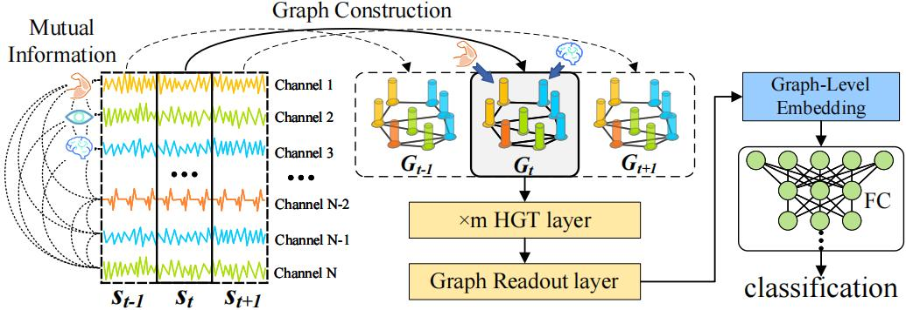

# Exploiting Interactivity and Heterogeneity for Sleep Stage Classification via Heterogeneous Graph Neural Network




## Requirements

- Python 3.7
- PyTorch 1.8.0
- PyTorch Geometric 1.7.0
- MNE 1.3.1
- CUDA 10.1

#### Steps:

1. Install Pytorch
```shell
pip install torch==1.8.0+cu101 -f https://download.pytorch.org/whl/torch_stable.html
```
2. Install torch_scatter
```shell
wget https://data.pyg.org/whl/torch-1.8.0%2Bcu101/torch_scatter-2.0.7-cp37-cp37m-linux_x86_64.whl
pip install torch_scatter-2.0.7-cp37-cp37m-linux_x86_64.whl
```
3. Install torch_sparse
```shell
wget https://data.pyg.org/whl/torch-1.8.0%2Bcu101/torch_sparse-0.6.9-cp37-cp37m-linux_x86_64.whl
pip install torch_sparse-0.6.9-cp37-cp37m-linux_x86_64.whl
```
4. Install torch_geometric
```shell
pip install torch_geometric==1.7.0
```


## Preprocessing

1. Install `unrar` to extract .rar file from ISRUC dataset.
```shell
sudo apt-get install unrar
```

2. Download the raw data:
```shell
./get_data.sh
```

3. Preprocessing the data:
```shell
python preprocess.py
```


## Training and Evaluation

For training and evaluation, modify the [config](https://github.com/zhouyh310/SleepHGNN/blob/main/config.py) file and run this command:
```shell
python training.py
```


## Results

Our model achieves the following performance on ISRUC-3:

| Accuracy | F1-score |
| :------: | :------: |
|  79.01%  |  77.02%  |


## Contributing

The code of this repository is released under the [MIT](https://github.com/zhouyh310/SleepHGNN/blob/main/LICENSE) license.

